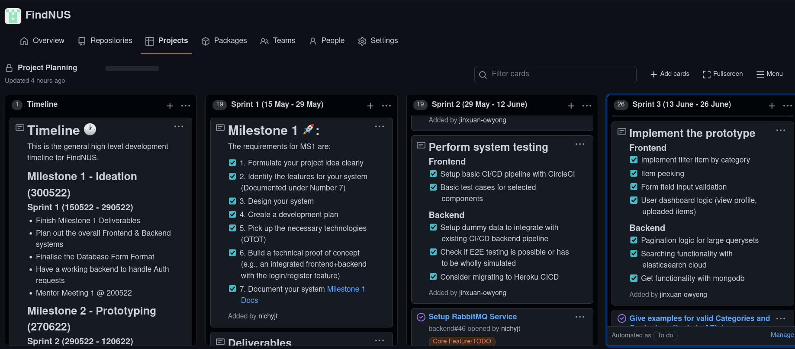
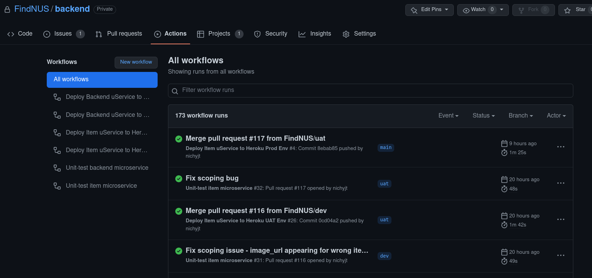
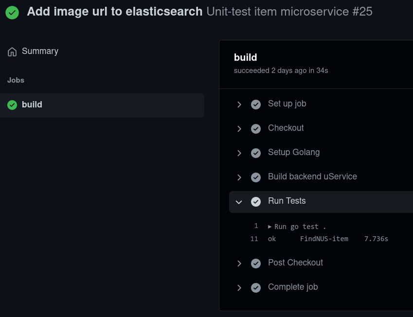
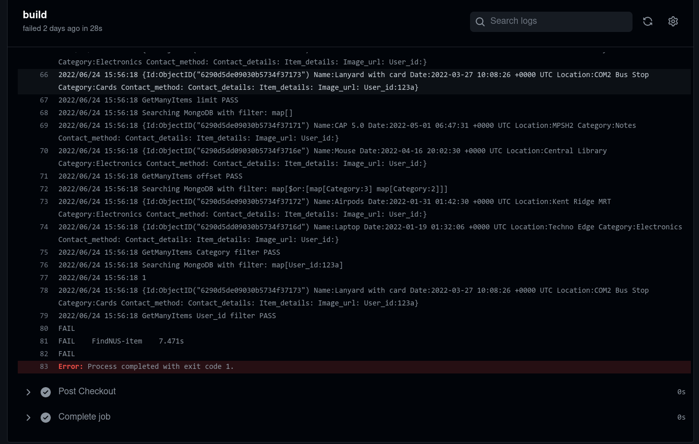
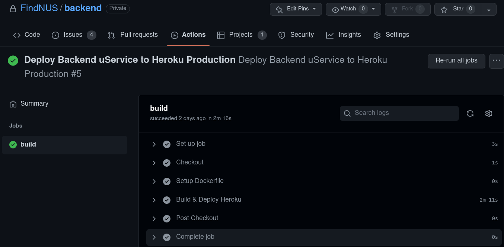
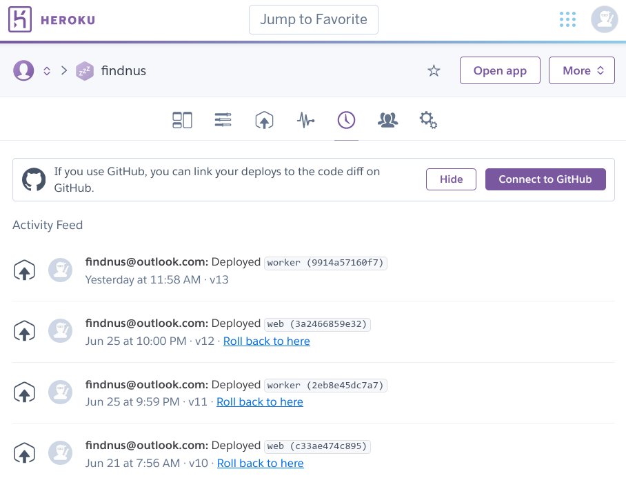

## Table of Contents
- [Sprint](#sprint)
  - [Code Review](#code-review)
- [Frontend](#frontend)
  - [DRY Principle](#dry-principle)
  - [Unit Testing](#unit-testing)
  - [CI/CD](#cicd)
    - [Continuous Integration](#continuous-integration)
    - [Continuous Delivery](#continuous-delivery)
- [Backend](#backend)
  - [API Documentation](#api-documentation)
    - [README: Backend REST API documentation](#readme-backend-rest-api-documentation)
  - [Unit Testing](#unit-testing-1)
  - [CI/CD](#cicd-1)
    - [Continuous Integration](#continuous-integration-1)
    - [Continuous Delivery](#continuous-delivery-1)

# Sprint
We follow a sprint of two weeks, tracked via Github Projects.
This is a snapshot of the three sprints that we have done so far in the project: 



## Code Review
During our fortnightly meeting with our mentor, code reviews were done by the mentor and we worked on implementing changes based on the review. 


# Frontend

## DRY Principle

We adhere to the Don't Repeat Yourself (DRY) principle, which is highly utilised in React components. This allows us to reduce the possibility of introducing errors, and have more predictable code.

<div align="right"><a href="#table-of-contents">Back to top</a></div>

## Unit Testing

We use Jest and React Testing Library to ensure code functionality in our application. For more information, [click here](../uiux/unittesting/#frontend).

<div align="right"><a href="#table-of-contents">Back to top</a></div>

## CI/CD

### Continuous Integration

New pushes and pull requests are automatically tested with GitHub Actions


### Continuous Delivery

When a pull request is opened to merge to either the production (main) or development (dev) branch, a deploy preview is triggerred and Netlify attempts to build a preview which can be tested by the developer, before the changes are merged into the base branch. If the build fails, new commits can be pushed and the build is triggerred again.


Upon merging, the target branch is automatically built and deployed.

<div align="right"><a href="#table-of-contents">Back to top</a></div>


# Backend

## API Documentation
### [README: Backend REST API documentation](./apisample/)  
Good API documentation is good SWE practice for backend. It reduces ambiguity in API usage and is important for knowledge retention for when new developers come and old developers go. This industry standard also makes it possible for computers to know how to interface with the API. 
We documented the backend API using the [**OpenAPI3** specification](https://swagger.io/specification/). 

Snippet from our yaml docs on how the OpenAPI3 specs can look like:
```yaml
paths:
  /item:
    post:
      description: |
        Add new Lost item to be put on Lookout on the database.
      parameters:
      - in: header
        name: Authorization
        description: Firebase ID token of user 
        required: true
        schema:
          type: string
          example: "Authorization: my-firebase-idToken"
      requestBody:
        description: Callback item payload
        content:
          'application/json':
            schema:
              $ref: "#/components/schemas/NewItem"
      responses:
        '200':
          description: Item registered into database
        '400':
          description: Rejected new item into database
        '401':
          description: Firebase credentials not invalid
```
This is not so human readable, so we made use of [open source openapi to markdown generator](https://github.com/openapi-contrib/openapi3-generator) to develop [Human-friendly docs](./apisample/).


<div align="right"><a href="#table-of-contents">Back to top</a></div>  

## Unit Testing
Code testing is covered in depth under the code test section. You can read more [about it here](../uiux/unittesting/).

## CI/CD
We leveraged Github Actions and Docker to automate **testing** and **continuously deploy** our code.  
This ensures that code works properly on a proper End to End environment before it goes live to production. Overall, CI/CD is used to (regressively) test code and automate the deployment process to smoothly deploy changes.  

Snippet of all CI/CD workflows in action:    

### Continuous Integration
Continuous integration is done whenever a pull request is made to the UAT or Production environments. If a microservice has changes, it will run **all** available unit tests to ensure that changes in one portion of the microservice did not break everything else.  
Example of Passing Unit Test:  

  

Example of Failing Unit Test that helped us troubleshoot issues before deploying to a live environment:  




### Continuous Delivery
Continuous delivery is done by pushing built **Docker** containers into Heroku's docker registry. 
Various deployment parameters are configured using github actions, and a synchronised, common runtime is instantiated by building a docker container using dockerfiles 

**Continuous Delivery Sample Job**  


**Heroku logs on deployment**

<div align="right"><a href="#table-of-contents">Back to top</a></div>

<div align="right"><a href="#table-of-contents">Back to top</a></div>
