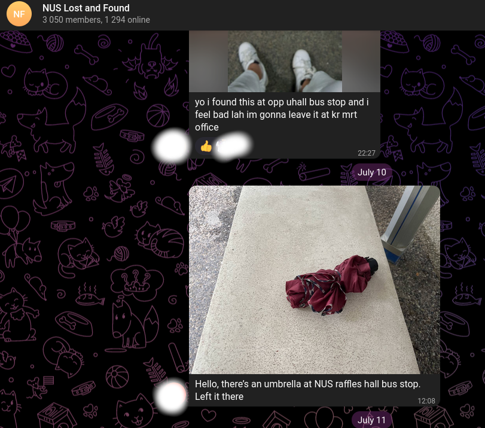

- [Introduction](#introduction)
- [Motivation](#motivation)
- [User Stories](#user-stories)
  - [The Founders](#the-founders)
    - [The TLDR](#the-tldr)
    - [In Detail](#in-detail)
  - [The Losters](#the-losters)
    - [The TLDR](#the-tldr-1)
    - [In Detail](#in-detail-1)
      - [Unofficial Groups.](#unofficial-groups)
      - [NUS Repo App.](#nus-repo-app)
- [Competitor Analysis](#competitor-analysis)
- [Aim of FindNUS](#aim-of-findnus)
  - [What makes FindNUS different](#what-makes-findnus-different)
- [Next: Project Scope](#next-project-scope)
# Introduction
This page documents the *Why* of FindNUS. We document our motivation, then validate it by investigating the Lost & Found User Stories. We lay out our aim and also look at what's out there currently vs our proposed solution. Finally, we continue with the next steps in our project scope.

# Motivation

FindNUS was created because we feel that the current Lost and Found (LNF) system in NUS sucks.

It is decentralized and messy. There are 2 primary systems that people who Lose or Find items can approach to register their LNF.
1.  RepoApp, the official LNF vendor serving NUS
2.  The plethora of unofficial telegram groups 

We felt that these 2 systems don’t put user experience first and are hard to navigate.

For example, the RepoApp is underutilised, and the telegram groups are filled with spam, making it hard to properly find your lost item, if it even exists in that group!       

To confirm our motivation and understand what specifically sucks about the current LNF situation in NUS, we investigated the user story of people who lose their items, **Losters**, and people who find lost items, **Founders**.    

# User Stories

## The Founders
### The TLDR
1. As someone who found a lost item, I want an **easy and flexible way of registering it** without having to register for an account.  
2. As someone who found a lost item, I am usually en-route and I **would not want to go out of my way** to pass the item to the security.

### In Detail  
This is what we found[^1] about Founders.  
[^1]: Pun unintended.  

**Scenario 1**: Founders can go out of their way to bring the item to any Lost and Found reporting points in NUS. These items end up being registered in the official RepoApp listing. This usually does not happen, because it is a hassle to go out of one's way to submit a lost item.  

**Scenario 2**: Founders can hold on to the item and try to contact the owner via unofficial communication channels. This is also a hassle to do, but can be more convenient to the Founder as they have the flexibility of connecting to the Loster via the communication channel (eg. telegram)   

**Scenario 3**: Leave the item where it was found but ping its location via unofficial
communication channels. This is usually what happens. A cursory look into one of these groups are full of these scenarios, such as the image below:  

  
You can even see for yourself in the actual group [here](https://t.me/NUSlostandfound).

## The Losters
### The TLDR
1. As someone who lost their item on campus, I want an active and easy-to-use platform to quickly search for my lost items.  
2. As someone who lost their item on campus and cannot find it anywhere online, I want to be helped and informed automatically if my item might be found.  

### In Detail 

If someone loses their things on campus, they can either:
1. Check various unofficial groups such as NUS Lost and Found or 
2. Try finding their items on NUS RepoApp.
Both have their own sets of problems.  

#### Unofficial Groups.
There are too many places to check. The Loster must scroll through hundreds of messages in big Lost and Found groups or message various smaller groups such as their house chat to ask around for their lost item. To the Loster, it is overwhelming to keep track of everything and frustrating to have to comb through so many groups and messages.
#### NUS Repo App.
What about the official platform? Items listed on RepoApp may suffer from survivorship bias.
Only items that are found by people who bother to spend time to bring lost items to the
reporting points in NUS are published on the RepoApp. It is far more likely that Scenarios 2 and
3 occur. As such, Losters who go on to RepoApp expecting to find their lost item are likely to
end up disappointed, try their luck in unofficial groups or give up.

# Competitor Analysis 

Our main competitors for LNF in NUS are the RepoApp and telegram groups. Through analysing their weaknesses, we identify problems FindNUS needs to tackle.

With the user stories, we narrowed down the failure of RepoApp and Telegram groups as a effective LNF system to a few, specific key issues.  
1. It's **inconvenient to submit lost items**[^2], leading to low utilization of RepoApp and the proliferation of telegram groups    
[^2]: While RepoApp suffers from a lack of listings – the Lost and Found telegram group is buzzing with activity. The listings on RepoApp barely change. This is because Finders are less likely to engage in Scenario 1.
2. RepoApp is **not optimised for mobile** and is **uncomfortable to use**[^3]  
[^3]: Mobile is the go-to interface for most users, especially when they are on-campus and on-the-move (which is usually when they realise that they lost something)
3. There are **no pictures** of the actual item that is found

4. **Inconsistent item descriptions (location, category)** for both telegram and RepoApp

5. **Bad search functionality**. Users are unable to search by category on RepoApp and telegram users must filter through dozens of groups and their hundreds of messages.

6. Users that lost something **must actively check the website for their lost item**

# Aim of FindNUS
With the 6 identified problems we identified, we want to tackle those with FindNUS.  

FindNUS aims to be **super accessible** for everyone - the losters and founders. In short, we make it **easy to submit items and search for them**.
## What makes FindNUS different
Unlike RepoApp or the ragtag band of telegram groups, FindNUS is different because we aim to 
1. Provide a **flexible submission system** that accommodates all 3 Finder scenarios.
2. Have an **Intuitive[^4] and User-friendly** Search Platform  
This is done by using **images, standardised categories, and text-based searches** to make the searching process more natural.
3. Be **Mobile-optimised**

[^4]: What makes searches intuitive? The ability to handle minor typos and search plainly using text without the need for advanced keyword wrangling like AND/OR, EXCLUDE, etc that you may see in other complex search systems. We achieve this by leveraging on ElasticSearch.    

# Next: Project Scope
With these goals in mind, we move on to the [project scope](/scope) where we lay down the timeline for development of FindNUS.
