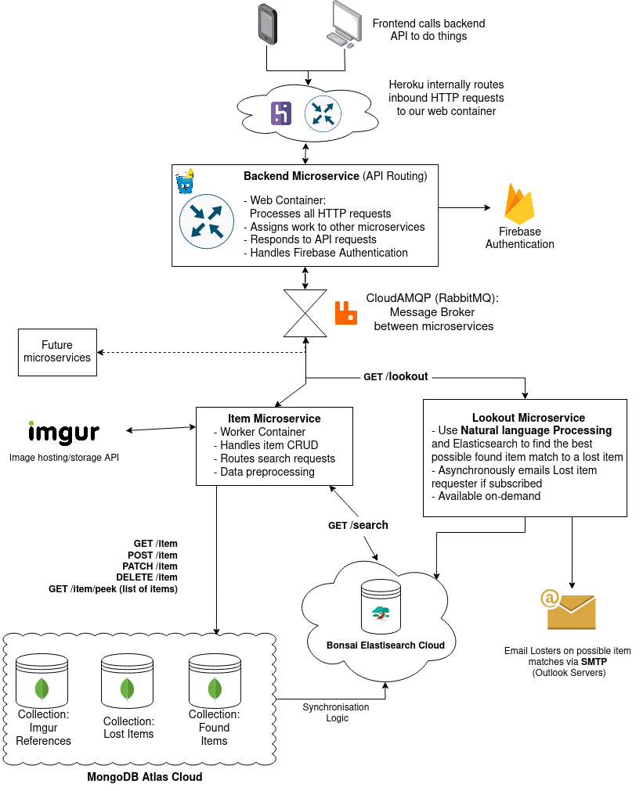
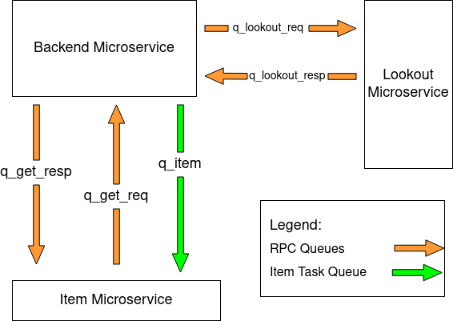
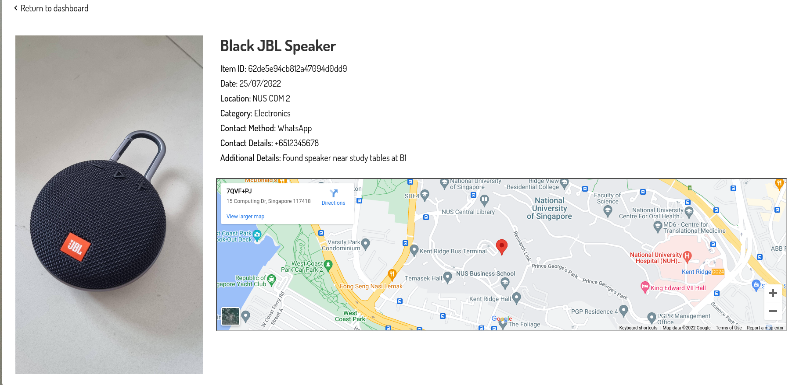
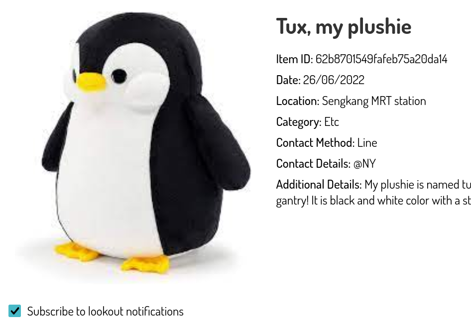
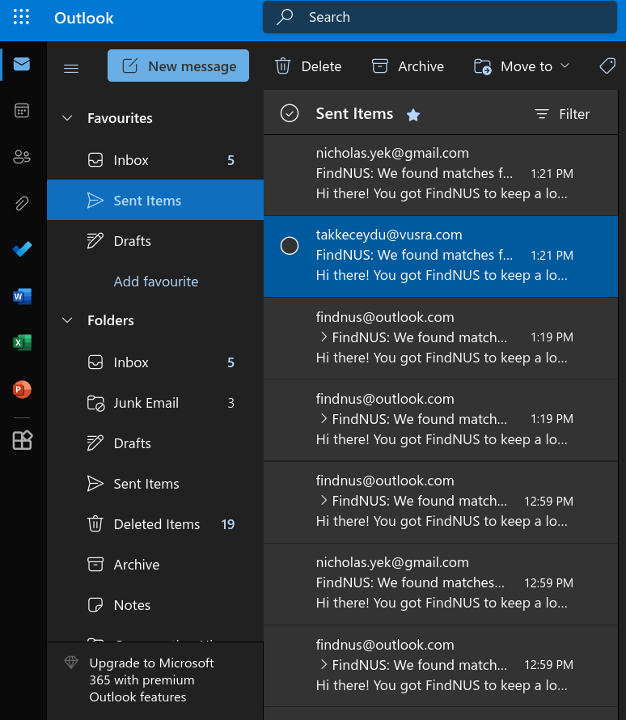
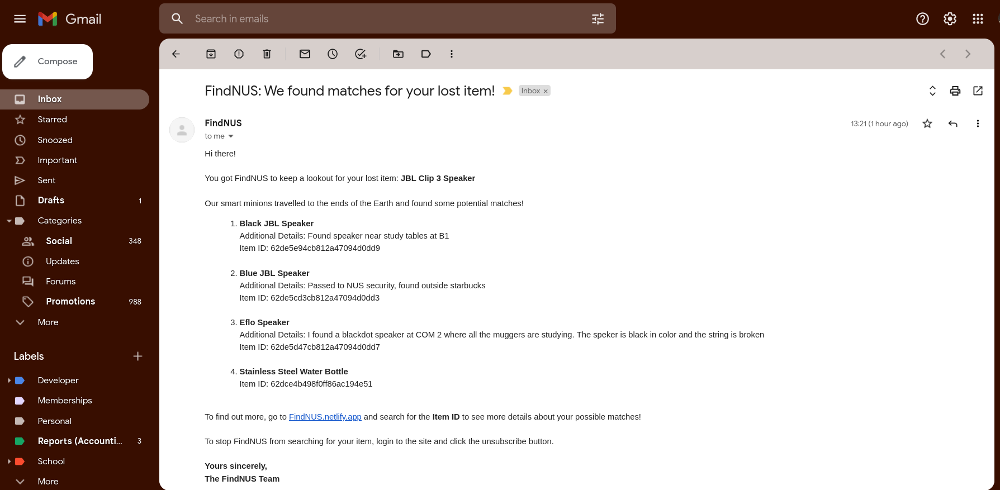

## [Table of contents](#table-of-contents)
- [Key Technologies](#key-technologies)
- [High-Level Overview](#high-level-overview)
- [Integration Details](#integration-details)
  - [Recieving HTTP requests from frontend](#recieving-http-requests-from-frontend)
  - [Sending messages between microservices](#sending-messages-between-microservices)
    - [Ensuring Thread-safe communication](#ensuring-thread-safe-communication)
  - [Creating, removing and updating, deleting Items](#creating-removing-and-updating-deleting-items)
    - [Image storage with Imgur](#image-storage-with-imgur)
    - [Synchronising the Search Engine](#synchronising-the-search-engine)
  - [Smart Lookout Service :star:](#smart-lookout-service-star)
    - [Examples](#examples)
  - [Smart Lookout Service (ON-DEMAND)](#smart-lookout-service-on-demand)
    - [Example: On-Demand Lookout](#example-on-demand-lookout)
  - [Smart Lookout Service (EMAIL) :mailbox_with_mail:](#smart-lookout-service-email-mailbox_with_mail)
    - [Example: Email Lookout in Action](#example-email-lookout-in-action)
- [Appendix A: Backend Design Choices](#appendix-a-backend-design-choices)
  - [Architecture: Microservice](#architecture-microservice)
  - [Platform: Heroku](#platform-heroku)
    - [Additional Considerations](#additional-considerations)
  - [Database: MongoDB](#database-mongodb)
  - [Message Broker: RabbitMQ](#message-broker-rabbitmq)
  - [Search Engine: Elasticsearch](#search-engine-elasticsearch)
  - [Language: Golang](#language-golang)
  - [Image storage: Imgur](#image-storage-imgur)

In this page, we document:  
1. The **key technologies** used
2. The  **high-level overview** of the Backend
3. The **integration** details

Specifically, this is a deep dive into how the various technologies are interfaced with each other. 
*Why certain technologies?*[^1]

[^1]: In Milestone 1, we documented in-depth why we used certain technologies instead of another.
[Link to the document](https://drive.google.com/file/d/1X4n5IalejDChWyBY_rGtnBOd1qMa3wq_/view?usp=sharing)  

# Key Technologies
This is a list of the technologies that we have used to build the backend.  
- Golang (Language)
- [Gin-gonic](https://github.com/gin-gonic/gin) (HTTP Router)
- Docker (Runtime)
- RabbitMQ (Message Broker)[^2]
- Heroku (PaaS)
- MongoDB (Database)
- Bonsai ElasticSearch (Search Engine)
- Firebase (Authentication)
- Imgur (3rd Party API)
- SMTP (Outlook Email Server)
- Prose (Golang NLP library)

[^2]: A message broker is needed to communicate between docker containers. This is a heroku perculiarity as the docker containers cannot talk to each other via HTTP due to security policy. In industry, message brokers are often used to coordinate work as well.

# High-Level Overview


This figure shows how the backend roughly works as a whole unit to provide the backend API for FindNUS' business logic. 
As of Milestone 2, we deployed **2 microservices**, backend and item. 

Backend is in charge of routing and item is in charge of CRUD.
The next section takes a closer look into **HOW** the technologies are integrated with each other.  

# Integration Details
This section dives deep into how the technology is integrated with one another to produce a cohesive backend.
We will explain the integration through **events**.

## Recieving HTTP requests from frontend
**Technologies Integrated (TI): Golang, Docker, Heroku**

The frontend needs things to be done, such as POSTing new items or GETting items from the database. This is done through the backend providing an API using the HTTP.  

These requests enter Heroku's platform and are forwarded to our **Backend** microservice. 
To actually use these requests, integration is needed between our Docker runtime and Heroku's platform.  
Heroku sends HTTP requests through a `PORT` env variable. We just need to get the port details and we can plug it into our logic to process the http requests.  

Snippet:
```go
	port := os.Getenv("PORT")
	if port == "" {
		// App is running locally
		port = "8080"
	}
```

Using Gin-gonic, we can create a HTTP router to listen to the http requests coming in via `PORT`. We can also ignore malicious/invalid requests by configuring the Cross-Origin settings.

Snippet:
```go
router := gin.Default()
	router.Use(
		cors.New(cors.Config{
			AllowAllOrigins:  true,
			AllowHeaders:     []string{"Origin", "Authorization", "Content-Type", "Access-Control-Allow-Headers"},
			AllowMethods:     []string{"GET", "POST", "PATCH", "PUT", "DELETE", "OPTIONS"},
			AllowCredentials: true,
		}),
	)
// ...Additional logic, omitted for brevity

// Listen for HTTP requests
router.Run(":" + port)  
```

## Sending messages between microservices
**TI: Golang, RabbitMQ**

In the microservices architecture, business logic is seperated into different runtimes/containers based on function.  
We will need to pass information between these runtimes, for example, the **Backend Microservice** needing to get a item's detail from the **Item Microservice**.  

The microservices are blocked from using HTTP communication between one another due to Heroku policy. So, instead of HTTP, we need to leverage on a message broker with its own communication protocol, **RabbitMQ** to coordinate messages between these microservices. 

In summary, using RabbitMQ, we defined three **queues** to send our own messages.  

**Item Queue `q_item`**  
Handles one-off messages that require no return response, such as POST and DELETE.  

**Remote Proceedure Call (RPC)[^3] Queue `q_get_req, q_get_resp, etc`**   
Handles messages that require a return response, such as GET and search queries.
[^3]: A RPC is something like a synchronous GET request. It enables two computers in seperate locations to send information to each other. [A primer if you are interested](https://www.geeksforgeeks.org/remote-procedure-call-rpc-in-operating-system/)

The below image illustrates the communciation pipelines between the various microservices using RabbitMQ.  



### Ensuring Thread-safe communication
In particular, when integrating Golang with RabbitMQ to implement the RPC pattern, each RPC job needs to be given a **unique** `correlation_id` to identify which RPC call the request belongs to. This is not implemented by the golang driver provided. So we created our own thread-safe unique correlation_id generator.  

Thread safety is needed via `sync.Mutex` as the HTTP requests are processed **in-parallel**, so there is a risk that multiple RPC subroutines may have the same correlation_id, which will cause bugs.  

Further, we **DO NOT** use randomly generated numbers as there is no guarantee that the randomly generated numbers won't be the same for 2 concurrent RPCs that call the random generator.  

Snippet:
```go
// JobID Unique Job ID. Overflows are OK
type JobId struct {
	mu sync.Mutex
	id uint64
}

var rpcJobId JobId

// Thread-safe jobId implementation
func GetJobId() uint64 {
	// Force one goroutine to access jobId at a time
	// To prevent a race condition
	rpcJobId.mu.Lock()
	defer rpcJobId.mu.Unlock()
	rpcJobId.id += 1
	jobId := rpcJobId.id
	return jobId
}
```

## Creating, removing and updating, deleting Items
**TI: MongoDB, Imgur, Elasticsearch**

There are many moving parts and integrations in the CRUD logic. So, a diagram explaining one of the processes, POSTing a new item:  
 

Updating and deleting items follow a very similar control flow, but is omitted for now due to repetition.  
The important integration details explained below:

### Image storage with Imgur  
When a new item is added with a raw base_64 string representing the user-submitted image, we store it on imgur. Imgur returns a deleteHash key for us to delete the image, as well as a link to the stored image. We store the hash and link on a Imgur reference database collection to manage our Imgur links.  
For delete item operations, the deleteHash is obtained from the Imgur collection to properly dispose of our Imgur image.

### Synchronising the Search Engine
Elasticsearch runs its own database store in order to index it properly to provide powerful searching capabilities. This means that we need to sync information between MongoDB and Elasticsearch.  

We have explored solutions such as industry-tested Logstash and open-source 'River', but they are either paid or are outdated for our version of Elasticsearch. 

**So, we settled on writing the database synchronisation logic ourselves in order to fully interface MongoDB and ElasticSearch**.  

We wrote equivalent CRUD operations on Elasticsearch for their MongoDB counterpart. If an item needs to be Added/Updated/Removed from MongoDB, a parallel and equivalent operation will be done on Elasticsearch.   

Snippet of a ElasticSearch Item Addition:
```go
// Handler for Adding Item
func ElasticAddItem(item ElasticItem) {
	// Check for item existence first as a safety catch to avoid redundant (the bad kind) copies
	if ElasticGetItem(item.Id) != (ElasticItem{}) {
		// Item already exists! This is likely an update. Delete it and re-add in.
		// Deletion rather than patching is done due to paywalled API
		log.Println("Deleting")
		ElasticDeleteItem(item.Id)
	}
	res, err := EsClient.Index().Index(IndexName).BodyJson(item).Do(context.Background())
	if err != nil {
		log.Fatal(err)
	}
	log.Println("Add item response:", res)
}
```
## Smart Lookout Service :star:
A "**Smart Lookout Service**" was added in Milestone 3 as an edge feature.  
**TI: Prose, Elasticsearch, SMTP**  

Its function is to help Losters look through the dozens of found items and intelligently find Found items that match the Loster's lost item.  

It uses **Natural Language Processing** to convert a Lost Item into a text-searchable query before sending it to a specially tuned ElasticSearch query to find good matches for the Lost item. We are using [`prose`](https://github.com/jdkato/prose), a NLP library for `go`.

A Lost (and found) item's data structure looks like this on MongoDB: 
```go  
type Item struct {
	Id              primitive.ObjectID 
	Name            string
	Date            time.Time
	Location        string
	Category        string
	Contact_method  string
	Contact_details string
	Item_details    string
	Image_url       string
	User_id         string 
	Lookout         bool   
}	
```
But how do we use NLP on this schema?  

First, we strip away all irrelevant terms that may dirty our search. So, irrelevant things like contact_details and user_id are removed.   
```go
type Item struct {
	Name            string
	Location        string
	Category        string
	Item_details    string
}	
```  
We then concatenate these fields into a long string, delimited by a fullstop '.' in order for the NLP tokenizer to recognise the different fields as different sentences.  
```go
item Item // an item of struct Item we want to process
rawString := strings.ToUpper(item.Name)
rawString += ". " + item.Category
rawString += ". " + item.Item_details
rawString += ". " + strings.ToUpper(item.Location) // Force prose to recognise this as an entity
```

We then use `prose` and feed in our prepared string to process out the keywords. We use `prose` to identify important features of the string - entities (people, places), nouns and adjectives.  

```go
doc, _ := prose.NewDocument(rawString)
	query := ""
	// Entities hold more weight than descriptive tokens, so add them in as duplicates
	ents := doc.Entities()
	for _, ent := range ents {
		query += " " + ent.Text
	}
	toks := doc.Tokens()
    // Filter for keywords
	for _, tok := range toks {
		// Take in all the nouns
		if tok.Tag == "NN" || tok.Tag == "NNS" || tok.Tag == "NNPS" || tok.Tag == "NNP" {
			query += " " + tok.Text
		} else if tok.Tag == "JJ" || tok.Tag == "JJR" {
			// As well as the adjectives
			query += " " + tok.Text
		}
	}
```  

The keywords that we are interested in are **Nouns** of all forms and **adjectives**. This is because key identifiers for a Lost and Found item lie in nouns and adjectives.  

### Examples

**Input**:
```json
{
    "Name": "Wireless Mouse",
    "User_id": "19fa21",
    "Date": "2022-04-16T20:02:30Z",
    "Location": "Central Library",
    "Category": "Electronics",
    "Item_details": "i found a logitech mouse at CLB level 2 in one of the cubicles."
}
```
**Output**:
```text
WIRELESS MOUSE CLB WIRELESS MOUSE Electronics logitech mouse CLB level cubicles CENTRAL LIBRARY
```

**Input**:
```json
{
    "Name": "Nalgene Water bottle",
    "User_id": "19fa21",
    "Date": "2022-05-26T08:51:48.782Z",
    "Location": "Digital Systems Lab",
    "Category": "Bottles",
    "Image_url": "https://upload.wikimedia.org/wikipedia/commons/0/07/Multi-use_water_bottle.JPG",
    "Item_details": "I lost my nalgene bottle during peak hour at the lab. The bottle has a sticker on it and it's handle is broken",
    "Contact_details": "@FindNUS",
    "Contact_method": "Line"
}
```
**Output**:
```text
NALGENE WATER BOTTLE Bottles NALGENE WATER BOTTLE Bottles nalgene bottle peak hour lab bottle sticker handle DIGITAL SYSTEMS LAB
```

This processed text is important as it will give us **relevant** ElasticSearch results. When we ignore common filler words like `the`, `a`, `I`, we are sure that the ElasticSearch results are due to the keywords.  

With the keyword string, we tune our ElasticSearch query to look for close matches.  


We make use of [`combined_fields`](https://www.elastic.co/guide/en/elasticsearch/reference/current/query-dsl-combined-fields-query.html#query-dsl-combined-fields-query) type of matching, where the query spans across multiple fields. Better matching items (more keyword hits) are given a higher score in the ElasticSearch algorithm.  

```golang
// In the ElasticSearch database, the Item data structure is the same as the `Item` struct defined above.  
mmq := elastic.NewMultiMatchQuery(
		qry,
		"Name", "Location", "Item_details", "Category",
	)
mmq.Type("combined_fields")
// Min match 3 clauses, 1 for category, 2 for others
// This filters out weakly matching items
mmq.MinimumShouldMatch("3")
mmq.FieldWithBoost("Name", 3) // Name matches are more significant
mmq.FieldWithBoost("Item_details", 2) // Item_detail matches catch 'hidden' significant keywords
```

With that, we are able to process Lost Items for their keywords and search for relevant matching Items.  

## Smart Lookout Service (ON-DEMAND)
Even though we have smart searching and filters, sometimes users may be lazy or still be unable to search for their item (Possibly due to miscategorisation or bad searching skills).

To counter this, FindNUS can help find lost items for users on-demand using the NLP Lookout service!  

The Smart Lookout Service has an on-demand function which is fully integrated with the frontend. The frontend calls a `/lookout` endpoint which triggers our Lookout service and returns relevant matches to the user. This is called the moment the user submits a lost item.   

### Example: On-Demand Lookout 
Putting ourselves in the shoes of a Loster, let's say we lost this item: 



Let's assume that we cannot find it on the main website for whatever reason or did not bother to search for it yet. We then submit a lost item request:  

**Lost Item Submission:**  


To demonstrate the accuracy and robustness of the Lookout system, we added typos, tweaked the name of the item and miscategorised our item. Once we submitted the lost item, we can view the lost item to automatically invoke the on-demand lookout request.  

In the lost item details page, **as we scroll down**, we can see what the Lookout service had found on-demand.  

  

As we can see, the returned options are relevant to our search and ranked appropriately. The lost item that we were trying to find is ranked first, followed by an item that has the same brand name, then followed by other items that best match our Lost Item's description.

As you can see, this automates the manual process of Losters having to scan through our website (or anywhere else) to search for suitable 'Found item' matches. This saves Losters the trouble of having to spend time and effort to crawl through the found items, and is especially helpful for people who may not have good searching skills or may not be good at english.  

This completes the end-to-end user flow for the On-Demand Lookout Service.  

## Smart Lookout Service (EMAIL) :mailbox_with_mail:  
What if the item simply does not exist on the found database? We cannot expect the user to 
 wait for hours refreshing the website to see if their lost item appears on the found database. 
 So, we allow the Loster to get FindNUS to keep a constant lookout for similar items that are good matches for the Lost item and get notifications for that.  

To do that, Loster can  click a checkbox (seen in the image below, bottom left) to subscribe to 
the email lookout service. FindNUS will run the subscribed lost item throught the lookout service 
daily and email the Loster (via their verified email) about possible item matches.  

 

The intent of this feature is to help Losters who cannot find their items and need help searching for it. This caters to situations where the found item has not been registered on the database yet.

### Example: Email Lookout in Action
Let's assume that we are the lost our speaker and submitted a lookout request in the image below and subscribed to lookout notifications (JBL Speaker).  

  

Chances are we chose to automate the searching process because we might not be free or could not find it in the database.  

**FindNUS sending emails**  
After a while, FindNUS does its daily Smart Lookout routine for email subscriptions.  
For lost items that have enabled email notifications, if the lookout routine finds possible matches,
 an email is sent to the Loster.




**Loster receiving lookout notification**  
In our case, FindNUS was able to find 4 similar matching items.  
  


The email convieniently includes the Item ID of the Found Item in question.  

This means that as a Loster, I can simply search for the Item's id to verify if it is
 indeed my item. From there, I can start retrieving it via the contact details provided. 

  

This completes the automated searching process. Throughout this end to end flow, there is no input from the Loster except for the item submission and email subscription.  

# Appendix A: Backend Design Choices 
The following was initially documented with references in Milestone 1. As it is important technical information, it is brought over here for documentation sake. [Link to the original document](https://drive.google.com/file/d/1X4n5IalejDChWyBY_rGtnBOd1qMa3wq_/view?usp=sharing). 

## Architecture: Microservice 
The backend’s overall function is to provide the front-facing web application a bunch of callable APIs. There are two general architectures to designing backend APIs6. 
Monolithic – business logic & functionality are compiled to one large application. 
Microservices – business logic & functions are factored out into logically grouped ‘services’ that are isolated from one another. They and communicate through communication protocols such as HTTP or remote procedure calls (RPC). 

|Factor|Microservices|Monolith|
|---|---|---| 
|Speed of development|Needs more initial groundwork to setup the backend infrastructure|Scales very fast initially, but is harder to maintain the bigger the project|
|Coupling & Redundancy|Each microservice is loosely coupled: They work independently of one another, making it fault tolerant|Tightly coupled components: changing something may break the entire app|
|Flexibility|Each microservice can be built with completely different languages, dependencies and even tech stacks|Very difficult to change the tech stack the deeper the application is in development|
|Feature Scalability|Scales well in the long run due to loose coupling of components|Diminishing scaling speed due to tight coupling of components|
|Load Scalability|Scales horizontally – able to serve more consumers by simply launching more microservice nodes|Scales vertically, which is expensive and will cause downtime| 
|Testing|Each microservice needs to be tested separately, with different scripts|End to end testing is easier as it only needs to be done on one application|

Ultimately, we chose to implement FindNUS using microservices architecture, primarily due to the factors highlighted in green. This is because: 

 
1. Loose coupling allows for redundancy. If some feature breaks, it will not take down the whole application with it. It also pinpoints us to the failing service for expedient debugging. This is important for Lost and Found services, which should be up 24/7 and cannot afford downtime. 

2. Its high flexibility allows us to add various feature without breaking core functionality. For example, adding future features that require drastically different tech-stacks such as Machine-learning powered Lost-and-found matching (Python + TensorFlow) can be added with ease without breaking the core components already in place.  

3. Its horizontal scalability allows us to scale FindNUS just-in-time based on real-time user load, minimising costs of running computational resources on Heroku and MongoDB. 

## Platform: Heroku 

To host our services, we needed something to host the backend code. We deliberated between cloud platform (s.a. Heroku, AWS), renting an actual server (s.a. Linode) and going serverless. 

|Factor|Cloud/PaaS (Heroku)|Actual Server (Linode)|Serverless (Netlify, AWS Lambda)|
|---|---|---|---|
|Load Scalability|Easily scalable with built-in load balancers|Need to manually handle load balancing and scaling by using tools such as Kubernetes|Easily scalable since the API triggers are handled by serverless calls|
|Uptime|Always on|Always on|Slower – tends to require more time due to cold start|
|Cost|Bounded to ‘free-tier’ limits|Most expensive: restrictive trial period|Bounded to number of API calls made (including testing).|
|Security|Abstracted away by cloud provider|Manual setup needed. Require a sysadmin’s expertise to fully secure it|Abstracted away by serverless provider|
|Testing|Comes with various free logging service and CICD tools built-in|Need to setup all testing tools manually|Few (free) tools for testing, logging and debugging available. Harder in nature due to reduced visibility of backend processes|

Ultimately, PaaS was chosen in favour of renting actual servers or going serverless. PaaS gives us the best middle ground. It provides flexibility to build FindNUS efficiently with high uptime and debugging visibility. Yet, have the more time-consuming and tedious backend groundwork such as security and load balancing abstracted away for us. 

 

|Factor|Heroku|AWS|Firebase|
|---|---|---|---|
|Cost|Free Forever|Most tools only have free trial for 1 year |Vast suite of free tools forever, excluding computational resources (Cloud Functions)|
|CPU Hours|1000/mo.|750/mo., 1-year free trial|N.A.| 

Among the PaaS providers, Heroku wins out the traditional PaaS go-tos such as Firebase and AWS as it provides us the most CPU hours and is the lowest cost amongst them. 

### Additional Considerations

**Region Placement: Minimising latency**. We had the choice between two regions for Heroku free-tier hosting, the EU and USA. We researched and realised that Heroku is hosted by AWS in Virginia (USA) and Ireland (EU)11. Based on an open cloud pinging service12, we determined that Heroku’s EU/Ireland region is the fastest (Annex D). Hence, we used the EU region and placed all other backend helper services (such as MongoDB Atlas) in the same region (EU/Ireland by AWS) in order to reduce latency between these components. 

## Database: MongoDB 

MongoDB is a document-based database system. It stores data primarily via a key-value store. This was chosen in favour of traditional relational databases such as PostgreSQL due to the nature of the Lost and Found (LNF) process. LNF items can be potentially registered in a myriad of ways, from photos to NUS security to even voice recording. 

**Flexible schema**. MongoDB, being document-based, allows flexible scaling of object schema without breaking the whole table. We can phase in more LNF Item data properties as we scale features without breaking the entire table to allow voice recording, video bubble links, GeoJSON, “isWithNusSecurity” flags and more. This is not doable with SQL. 

**Ease of use**. There is no need for normalization13. This makes obtaining data easier since there is no need to join multiple tables from a normalized SQL database. Every parameter can be accessed straight from a document database. 

**Schema: Optimising memory usage**. As defined in Annex E, certain fields such as item category are stored as 32-bit integers rather than strings. Internally on the backend, there will be mapping logic converting the integers to and from their associated strings (s.a. 1 -> Cards, 2 -> Umbrella). This is done so to optimise each Item’s memory size. A 32-bit integer (4 bytes) holds less memory space compared to a string with at least 4 characters. 

## Message Broker: RabbitMQ 

Why do we need a message broker? For some context, in the Heroku environment, individual microservices are wrapped in containers called “Dynos”. These dynos are secured in the network and cannot communicate to one another14 over TCP. Hence, a communication protocol is required to pass information from one microservice container to the other for ‘work’ such as CRUD to be done. 

We compared between three communication protocols that define how isolated containers can talk to each other: Remote procedure calls (RPC), REST and Message Queueing.  

|Factor|RPC|REST|Message Queues (MQ)|
|---|---|---|---|
|Heroku Support|Possible with RPC-enabling message brokers|Impossible, inter-container TCP communication is not allowed|Possible|
|Speed|Fastest|Slower than RPC|Slowest|
|Load Stability|Less stable|Stable|Stable| 
|Message stability|Messages can get lost and is unrecoverable|Message loss is recoverable due to TCP handshake protocol|Messages are persistent and guaranteed to be delivered|


Since Heroku does not provide support for REST architecture for inter-container communication, we are forced to use RPC and Message Queuing, which is recommended by Heroku. To use RPC &/or MQ, we need a message broker. We chose CloudAMQP (RabbitMQ) as it has extensive documentation on integration with Heroku. 

RabbitMQ is flexible – it allows us to use message queues and RPC. Rather than stick to one communication protocol, we plan to use both RPC and MQ as both protocols are best suited for certain use cases. 

**RPC: Searching**. RPC is very fast compared to the other protocols. This makes it suitable for short-lived operations that require quick responses, such as searching and autocompletion (Elasticsearch API calls). Even if the message is lost, it is tolerable in the case of autocompletion and just-in-time searching. 

**MQ: Database CRUD**. There are certain operations that need stability and data persistence. When submitting LNF requests/items, the end-user is likely to only POST the request once and leave the application. We cannot afford the situation where a user submits an item request/registration, but the message gets lost halfway in the backend and the item is not registered in the database. MQs can be configured to guarantee delivery and data persistence, this adds stability to the CRUD process which is critical to the Lost-and-found process. 

## Search Engine: Elasticsearch 

Elasticsearch (ES) was chosen as the search engine for our application due to the nature of our LNF item schema. Effective searches for lost items rely heavily on string-based parameters such as its name and item details. Further, the “Item_details” is effectively full text, where the users write a long description of the item which allows for flexibility in registering LNF items. For example, an item detail can be: “the bottle’s handle is broken, and it has a NUS sticker on it”. 

**Full-text search**. ES was built with text searching in mind23. It is optimised for indexing and searching through large bodies of text, such as the “Item_details” parameter. Although it is entirely possible to use full-text searches on SQL and even MongoDB, it is far simpler and to implement via ES. Most importantly, ES outperforms other competitors in querying speed. 

## Language: Golang 

Golang is a widely used server-side language. Compared to other languages, we chose Golang for the following reasons: 

1. Golang is a relatively fast server-side language.  
2. Easy to use HTTP server library that is concurrent by nature. 
    (https://github.com/gin-gonic/gin) 
    Unit-testing is built into the language and is simple to make and run.  

## Image storage: Imgur 

Images tell a thousand words, which is why we included Images as part of the schema to submit a new item to the LNF database (Annex C). It is easier to identify lost items from pictures than wordy text. However, images take up a lot of space. To estimate storage requirements, we assumed that an average smartphone takes 12MP images which is about 3.6MB per photo.  Our free-tier MongoDB has a storage limit of 512MB. If we only used it to store images, we can fit approximately 142 images, which is very small. 

The above estimation discounts the fact that smartphone cameras are getting even more powerful, with the upper limit going as high as 108MP (approx. 30MB/photo). Even if we use lossy compression, the disk space required by photos will still be in the order of megabytes. Hence, we cannot afford to directly store images on our backend servers. 

We decided to use Imgur as a 3rd party image hosting service to offload the storage needs for FindNUS. This is because it has a generous upload limit of 1250 images per day (52 images per hour) and image URL endpoints are persistent. 