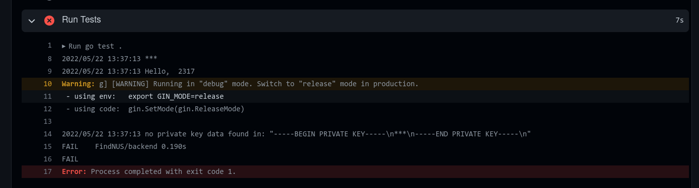

The development of FindNUS had its fair share of challenges. Things did not always go to plan and we often had to think out of the box to solve these issues. In this page, we document some of the interesting and significant challenges we faced while building FindNUS.  
- [Heroku Security Breach](#heroku-security-breach)
- [ElasticSearch Woes](#elasticsearch-woes)
  - [Pricing](#pricing)
  - [API Paywall](#api-paywall)
  - [Synchronising Logic](#synchronising-logic)
  - [Database limit](#database-limit)
- [Obscure Github Secrets Bug](#obscure-github-secrets-bug)
# Heroku Security Breach
When we embarked on FindNUS, we initially wanted to build our backend using Heroku's add-on CICD tool that integrated with Github. However, unknown to us at the time, Heroku had suffered from a [massive security breach](https://status.heroku.com/incidents/2413) that led to code in Github private repositories and OAuth tokens being stolen. (We were not affected directly in the breach as it happened before Orbital went live)  

As a result, **Heroku disabled their Github integrated CICD tooling**. We still needed to perform CICD and had to pivot towards other means of doing it. So, we manually set up our CICD pipelines using **Docker** containers and open-source **Github Actions**. Fortunately, our custom-built CICD pipeline worked well and achieved our objective of having our code be tested systematically and deployed automatically to Heroku.  

# ElasticSearch Woes
ElasticSearch (ES) is a search engine which is critical to FindNUS, making searches easy and typo-resistant. However, it gave us quite a few headaches when trying to integrate it to our system. These are the challenges we faced: 
## Pricing
The mainstream ES cloud vendor `elastic.co`'s solution is at least [USD$95/mo](https://www.elastic.co/pricing/), which is way too expensive for our project in its development stage. We considered self-hosting our elasticsearch instance using RaspberryPis or through another cloud provider, but recognised that latency and database stability will be issues if we did that.  

After much research, we found Bonsai ElasticSearch, an ES cloud provider that had a true free-tier. However, Bonsai also proved a challenge to work with.

## API Paywall  
As we experimented with Bonsai's API, we found that certain critical functions were paywalled. For example, if we wanted to update an item, we would normally do this by calling a function `UpdateByQuery(...)`. However, this was paywalled by Bonsai!

We worked around these by spoofing equivalent API functions. If we needed to update an item, we would delete the item's instance on our ES database then add the new, updated instance. This is not ideal but the best we could do given our budget and circumstances.  

## Synchronising Logic
After experimenting with ES, we discovered that we needed a way to synchronise our ES database store with our main MongoDB store. We have explored solutions such as industry-tested Logstash and open-source ‘River’, but they are either paid or are outdated for our version of Elasticsearch. To overcome this, we [built our own database synchronisation logic](/technical/backend/#synchronising-the-search-engine).  

## Database limit
Unlike other Database providers such as MongoDB Atlas, Bonsai only allowed us to have **one** cluster. This meant that our data cannot be seperated nicely into our Production and UAT environment. We worked around this by creating two indexes (analogous to tables) within the cluster, one for our production and the other for our UAT environment.   

# Obscure Github Secrets Bug  
We stored keys and passwords as Github Secrets. Github even [helps to redact](https://docs.github.com/en/github-ae@latest/actions/security-guides/security-hardening-for-github-actions) these secrets in Github Action logs as an added layer of security. This is excellent, until we encountered a subtle bug. Some keys such as RSA certificates, use newlines `\n` as part of the formatting. BUT - Github treats newlines as literals, i.e. instead of a newline we get the **characters** \ and n.  

As a result, when we took a RSA key from Github, the certificate formatting was completely messed up. Our Unit Testing caught this bug, telling us that our certificate was invalid.   



Figuring out why was a nightmare: When we printed the certificate on Github actions, it was redacted as you can see in the above picture, making it impossible to debug. When we tried debugging via print logs inside the application, the certificate showed up as expected.   

We eventually discovered this bug by measuring the length of the key when it is loaded. When the key loads as expected, the length of the key was `n = 1704` characters. When we loaded the key from github actions, the length was `m = 1732`. Where are all the mysterious characters coming from? We suspected that the only character in the RSA certifiate that may produce this spooky behaviour was the newline characters. We then realised that the difference between the characters `m - n = 28`, and when we counted the number of literal \n in our key, it was also 28! This indicated to us that Github was treating \n as literal \ and n, not a single newline character.

At long last, the fix was a simple 1 liner. 

```go
private_key, _ := os.LookupEnv("FIREBASE_KEY")
private_key = strings.ReplaceAll(private_key, "\\n", "\n") // the fix
```
