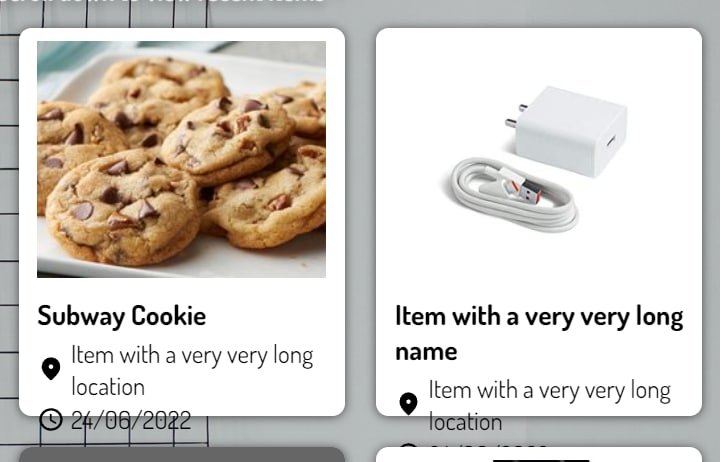

<!-- omit in toc -->
## Table of Contents
- [User Testing Framework](#user-testing-framework)
  - [User Testers](#user-testers)
  - [Probing Questions](#probing-questions)
- [User Testing Conduct](#user-testing-conduct)
  - [Task List](#task-list)
  - [General Questions](#general-questions)
  - [Optional: Documentation Testing](#optional-documentation-testing)
- [Feedback Received](#feedback-received)
  - [Feature Requests](#feature-requests)
  - [Usability Issues](#usability-issues)
  - [Critical Issues](#critical-issues)
  - [Misc Issues/Nitpicks](#misc-issuesnitpicks)
  - [New Deliverables](#new-deliverables)

# User Testing Framework
We conducted User Testing of the application by conducting a [**Think Aloud**](https://www.nngroup.com/articles/thinking-aloud-the-1-usability-tool/) test with our testers.  

In the test, we defined a set of tasks broken down into functional and 
non-functional tests for the user to complete.  We encouraged the tester to 'think aloud'
by narrating their thought processes while they are completing the tasks.   

## User Testers
Our target audience are NUS students and staff. Hence, for the user testing, 
we recruited some NUS students who have not seen our web application before to test out out website. 

## Probing Questions
If the user is very silent during the test or has interesting think aloud observations, we will ask probing questions to futher elicit responses and get a deeper insight into the possible difficulties that they faced. 

|Question|Intent|
|---|---|
|What's going through your mind?| Find out why the tester is silent. They may be stuck or deep in thought that contains valuable feedback |
|Why do you say that {some observation}?| Probe the tester for their rationale. For example, the user says that the item submission form is hard to use. |
|What do you think is confusing about {task}?| If the user is confused about a task, find out exactly what makes it confusing |
|How did you feel about doing {task}?|Understand how the users feel about doing certain things. Emotions such as frustration and anxiety may be indicative of a deeper problem in the UX of the application | 

# User Testing Conduct

We got the user testers to complete the following tasks chronologically as a form of usability testing. 
While the users performed the tasks, we encouraged them to **think aloud** and used probing questions as defined above to help maximise the insights that the testers may have.  

These were the tasks that we got the users to do:  

## Task List

| Task Name           | Task Details                                                                                                                                                                                                                               | Expected Result                                                                                                                                                                           |
| --------------- | ---------------------------------------------------------------------------------------------------------------------------------------------------------------------------------------------------------------------------------- | ----------------------------------------------------------------------------------------------------------------------------------------------------------------------------------------- |
| Searching          | Search for the item "iPhone 13" and view it                                                                                                                                                                                        | User should obtain the following item                                                                                                     |
| Typo testing | Search for the item "ipho 1a"| User should still be able to obtain the following item in the search results |
| Previewing            | View recently uploaded items                                                                                                                                                                                                       | User should minimally see these items                                                                                                |
| Filtering          | Filter recent items with the category "Electronics"                                                                                                                                                                                | User should minimally see this item                                                                                                   |
| Submit an item  | Submit a found item of your choice (image is optional)                                                                                                                                                                             | User should see their uploaded item (Possibly requires refresh after redirect)                                                                                                            |
| Login           | Attempt to login using either their own mobile number, an international phone number from [this page](https://receive-sms-free.cc/) or the following test account: __Phone Number:__ +6511111111 (no spaces) __OTP:__ 111111 | For the test account, user will see the following information:  For other accounts, a different user ID will be displayed |
| Dashboard Items | View items uploaded with the test account above                                                                                                                                                                                    | User should minimally see this item                                                                                                 |
| Logout          | Attempt to logout of the application                                                                                                                                                                                               | Redirected to home page with login option                                                                                                                                                 |

<a href="#table-of-contents">Back to top</a>

## General Questions
After the Think Aloud test, we asked each participant all of the following questions.  

|Question|Intent|
|---|---|
|What are the most memorable features of FindNUS?|Appraise which FindNUS features had the most perceived value and impact to the user.|
|If you could change one thing about FindNUS, what would you change?|Directly query for pain points that the user may have. |
|Do you think you will use FindNUS? What makes you say yes/no?|Find out how easily adoptable our application is to the regular user.|
|How do you think FindNUS compares to the current lost and found system in NUS?|Find out how competitive FindNUS is in terms of usefulness compared to the telegram groups and RepoApp. |

## Optional: Documentation Testing
For the NUS students who had technical programming knowledge, we also asked them give feedback on our backend API documentation for readability and usability.  

A sample of the API documentation can be found [here](/technical/swe/apisample/), 
and the deployment can be accessed at https://findnus.herokuapp.com/

# Feedback Received
We then compiled all of the feedback we had recieved from the Think Aloud testing and General Questions are organised them into a few broad categories. These organised feedback are compiled below:  

## Feature Requests
1. A user commented that they would prefer to be able to narrow down the search to a range of dates as it will make it the experience less cluttered and more focussed    

## Usability Issues
2. Phone numbers must be prefixed with +65 for the OTP to work.  
    Most testers assumed that the number without the country code will work
3. Images took a long while to load for some of the items
4. Items with very long names and locations have their text exceeding the item card  

  

## Critical Issues
5. A few users tested the website on their phone. The website did not render nicely for them and made the experience much more frustrating for them.  
6. Some users commented that if there are many found items on the dashboard, it would make it harder for them to search for their lost item. It may be good if they can get item reccommendations for their lost items, such as Shopee/Amazon 'similar items' reccomendations
7. A significant number of testers feedbacked that if the user base is not strong, there is not much point to using the web application

## Misc Issues/Nitpicks
8. The background image for the main website seems quite random and irrelevant to the lost and found theme
9. There is some unused white space in the specific item view page
10. The submission buttons for Lost and Found items are quite big  
11. The login page seems a bit empty

## New Deliverables 
With these feedback, we formulated a set of deliverables to act on the user feedback in **Milestone 3**. These extra deliverables can be found in the [Project Scope MS3 Featureset](/scope/#milestone-3-edge-features). Nonetheless, we list the deliverables here as well.  

**Identified Deliverables**:
- Date filter for item preview on homepage (1)
- Allow users to input 8-digit phone numbers starting with 8 or 9 for Singapore numbers (2)
- Hide overflowing text for preview items with long names and locations (2)
- Image loading optimisation via thumbnailing Imgur links (3)
- Fix the text overflow bug (4)
- Mobile optimisation (5)
  - Media (Viewport) queries for various pages
  - Implement sticky item filter menu for non-mobile devices for ease of access to filters
- Smart Item Finder (i.e. Lookout Service) (6)
